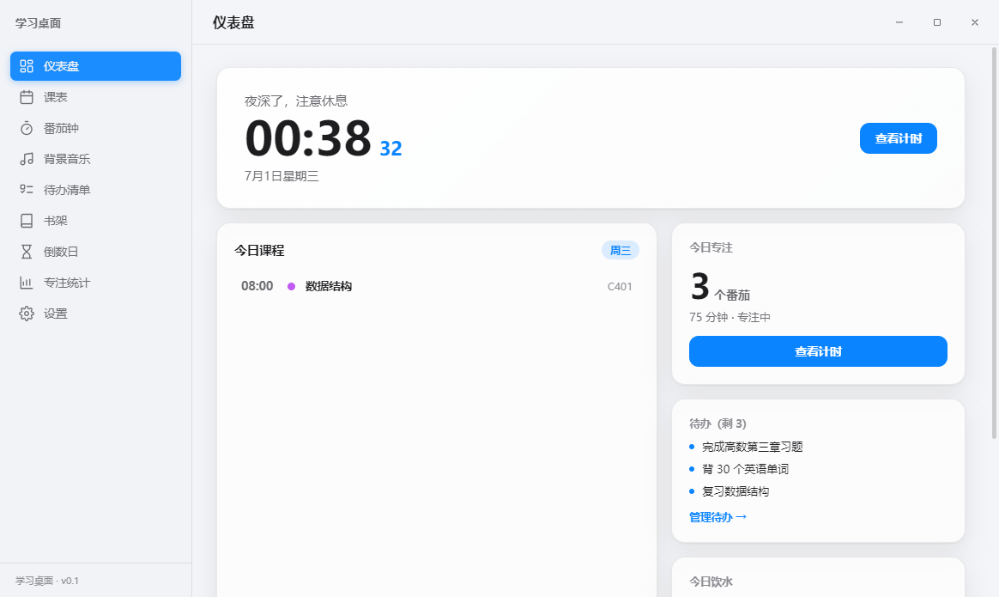
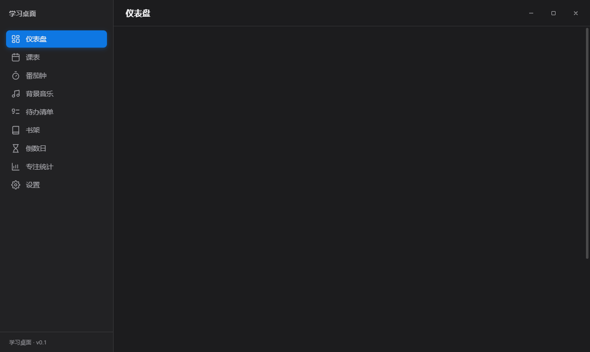
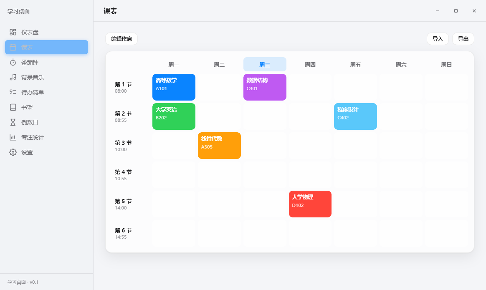
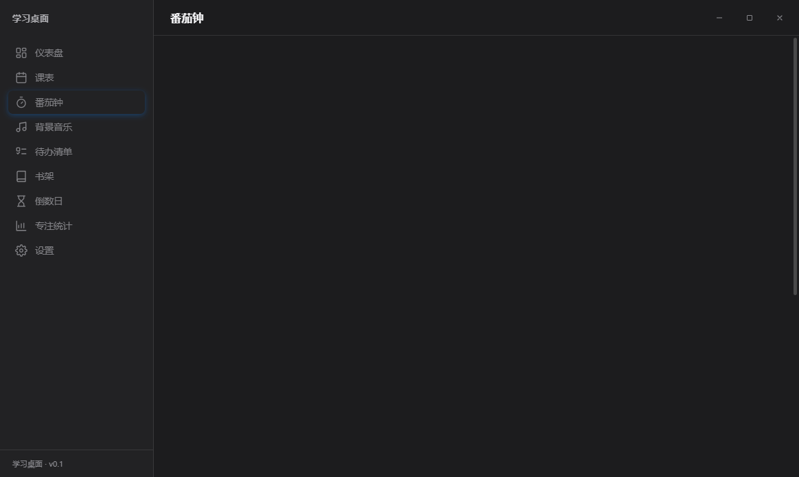
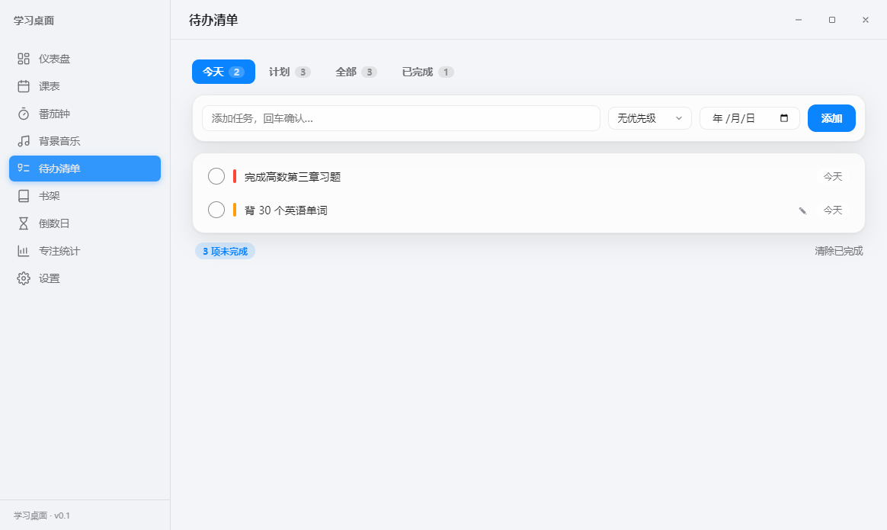
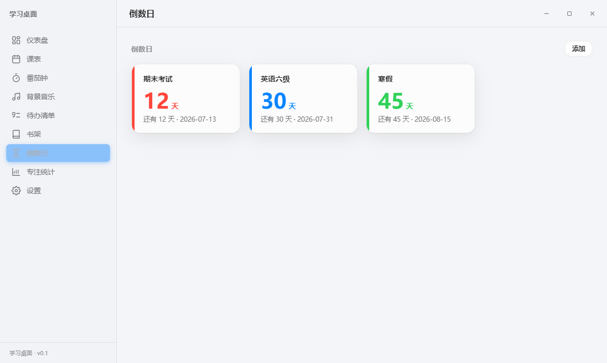
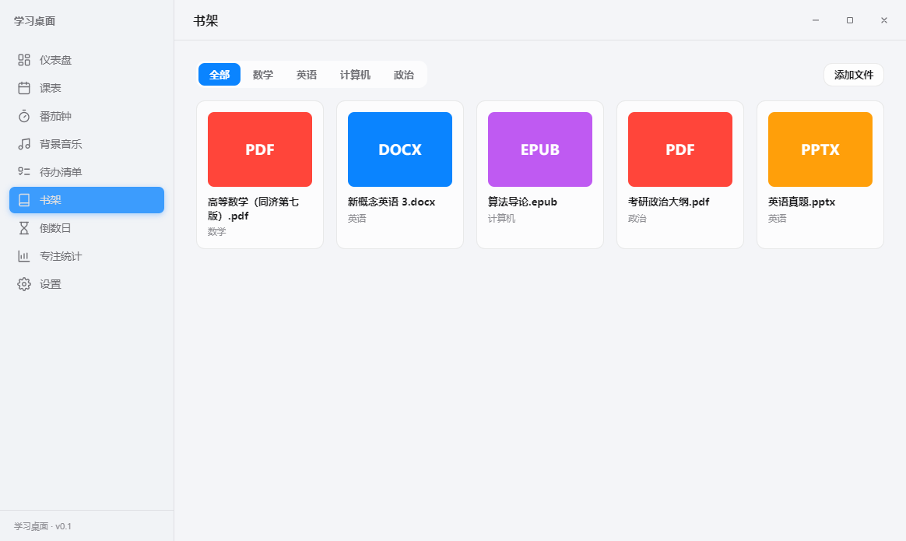
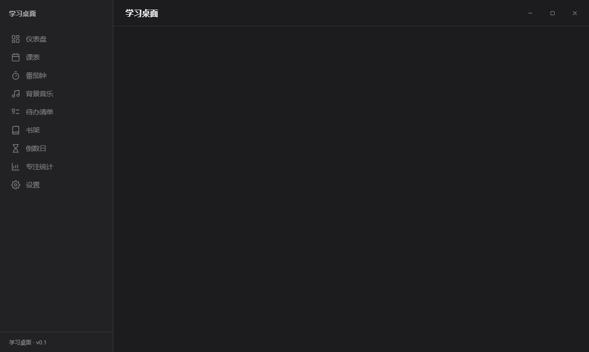
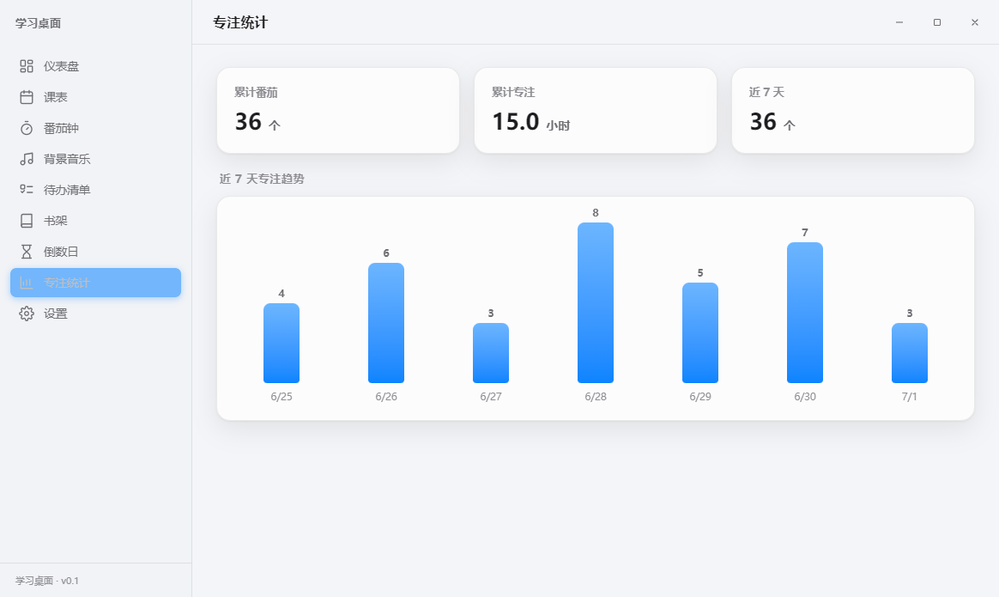
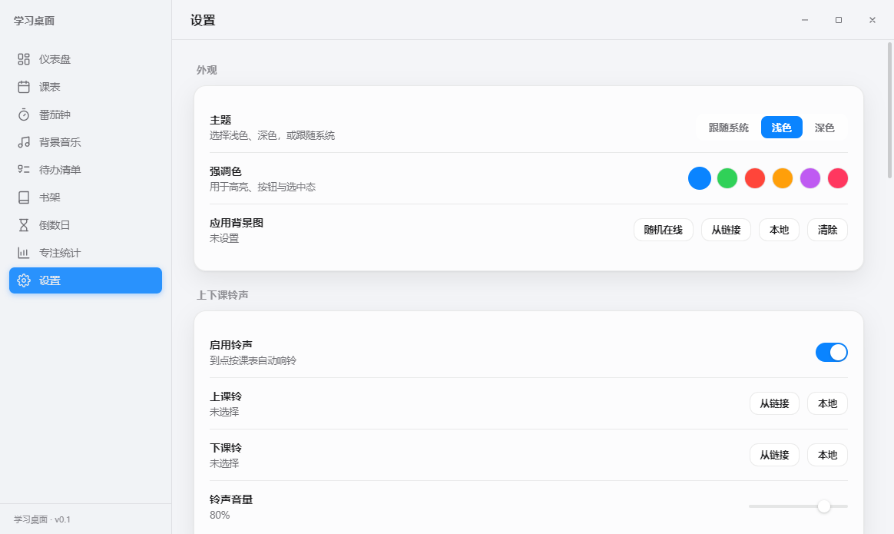

<div align="center">

# 📚 学习桌面 · StudyDesk

**一款运行于 Windows、外观模仿 macOS 的全能学习辅助桌面应用**

课表 · 上下课铃声 · 番茄钟 · 锁屏专注 · 背景音乐 · 待办 · 倒数日 · 书架 · 专注统计 · 专注森林 · 深呼吸 · 喝水/健康提醒


</div>

---

## ✨ 简介

**学习桌面（StudyDesk）** 把学生日常需要的工具整合进一个精致的桌面应用：左侧 macOS 风格侧边栏导航，半透明毛玻璃卡片，明暗双主题与可定制强调色，配合系统通知、托盘常驻、全局热键与桌面浮窗，帮助你**专注学习、规划时间、养成习惯**。

> 全部数据保存在本地，无需登录、无需联网即可使用；媒体资源（壁纸 / 铃声 / 音乐）支持本地导入与在线链接添加。

<div align="center">



</div>

---

## 📸 界面预览

<table>
  <tr>
    <td align="center"><b>仪表盘 · 深色</b><br/></td>
    <td align="center"><b>课表</b><br/></td>
  </tr>
  <tr>
    <td align="center"><b>番茄钟</b><br/></td>
    <td align="center"><b>待办（滴答清单风格）</b><br/></td>
  </tr>
  <tr>
    <td align="center"><b>倒数日</b><br/></td>
    <td align="center"><b>书架</b><br/></td>
  </tr>
  <tr>
    <td align="center"><b>背景音乐</b><br/></td>
    <td align="center"><b>专注统计</b><br/></td>
  </tr>
  <tr>
    <td align="center" colspan="2"><b>设置</b><br/></td>
  </tr>
</table>

---

## 🎯 功能特性

### 📅 课表
- 周视图网格，**当前课程高亮**、今日列高亮
- 自定义作息时间段（节次起止时间随意调整）
- 点格子增删改课程：名称 / 教师 / 地点 / 颜色 / 星期 / 节次
- 课表 **JSON 导入 / 导出**

### 🔔 上下课铃声
- 到点按课表**自动响铃**（上课 / 下课不同铃声）
- 内置**真实校园铃声**：校园电铃「铃铃铃」、威斯敏斯特音乐钟声（合成，离线可用，已设为默认上/下课铃）
- 上课同时弹**系统通知**
- 铃声支持**在线搜索**（搜「上课铃声/下课铃声」）、本地文件或在线链接，音量可调

### 🍅 番茄钟 & 专注
- 工作 / 短休 / 长休循环，时长与长休间隔可配，可自动开始下一阶段
- 圆环进度 + 大号倒计时，完成自动计入统计并提示音
- **锁屏壁纸专注**：专注时自动全屏置顶大字倒计时，防止分心（Esc 暂停退出）
- **4 种锁屏时钟样式**：极简 / 翻页钟 / 像素 LED / 呼吸光
- **呼出全屏时钟弹窗**：番茄钟页一键呼出全屏时钟（复用所选样式），随时进入专注视图

### 🌳 专注森林 & 番茄金币
- 每完成一个番茄 **+金币并种下一棵树**，积累成一片专注森林
- 金币可在**树种商店**解锁松树 / 樱花 / 椰子 / 枫树 / 圣诞树并切换
- 仪表盘「今日专注」直达森林

### 🌬️ 深呼吸 / 冥想
- 课间跟随圆环做 **4-4-6 节律呼吸**（吸气 → 屏息 → 呼气），带阶段提示与组数计数，快速放松回到专注

### ✅ 待办清单（仿滴答清单）
- 智能列表：**今天 / 计划 / 全部 / 已完成**（带计数）
- 优先级（高/中/低）彩色旗标、截止日期（逾期红色高亮）、备注
- **重复任务**（每天 / 每周，完成自动生成下一次）

### ⏳ 倒数日
- 考试 / 截止日 / 重要日子倒计时，按剩余天数排序
- 每张卡片可设**自定义背景图**（本地 / 在线 / 链接）
- 仪表盘底部显示最近一个「距 X 还有 N 天」

### 📚 书架
- 添加 PDF / 电子书 / Word / PPT / Excel 等，**按分类整理**
- 卡片按扩展名上色，点击用**系统默认程序打开**

### 🎵 背景音乐
- **在线曲库**：进入即自动拉取轻音乐列表，点条目即播放、＋收藏入库（在线源为公开音乐接口）
- **一键导入网易云 / QQ 音乐歌单**：粘贴歌单分享链接自动解析曲目（基于 Meting 式聚合接口，接口地址可在设置更换为自建以提升稳定性）
- **在线搜索** + 关键词自定义，本地导入 / 链接添加
- 列表 / 单曲 / 不循环，音量记忆，跨页面持续播放
- > 提示：在线源受版权限制，部分歌曲可能只能试听或无法播放

### 📊 专注统计
- 近 7 天番茄柱状图、累计番茄数与专注时长

### 💧 喝水 & 🧍 健康提醒
- 喝水提醒（可配间隔 + 每日目标），仪表盘「喝一杯」计数与进度
- 久坐提醒、护眼 20-20-20

### 🪟 系统集成 & 个性化
- macOS 风外壳 + 右上角窗口控制；**桌面浮窗**（置顶可拖：时钟 + 下节课 + 番茄迷你计时）
- **关闭即最小化到托盘后台常驻**（启动即建托盘，点右上角关闭不退出，托盘右键「退出」才真正退出）
- 系统托盘常驻、开机自启、全局热键
- **全局搜索 Ctrl+K**（页面 / 课程 / 待办 / 书架 / 倒数日）
- 明暗主题 + 6 种强调色 + **自定义应用背景图**（不透明度 0–100% 可调）
- **数据备份 / 恢复**（一键导出 / 导入全部 JSON）
- **自动更新**（基于 GitHub Release：即时检查提示 + 下载进度条 + 下载完成通知 + 一键重启安装）

---

## 🧱 技术栈

| 层 | 技术 |
| --- | --- |
| 桌面外壳 | Electron 33 |
| 构建 | electron-vite 2 + Vite 5 |
| 前端 | Vue 3.5（`<script setup>` + TypeScript） |
| 状态 / 路由 | Pinia 2 / Vue Router 4 |
| 持久化 | 自实现 JSON Store（系统 `userData` 目录） |
| 打包 / 更新 | electron-builder 25 + electron-updater |
| 测试 | Vitest（单元）+ 运行时冒烟脚本 |

---

## 🚀 快速开始

```bash
# 安装依赖（已内置 npmmirror 镜像，国内无需额外配置）
npm install

# 开发运行（热更新）
npm run dev

# 类型检查 / 单元测试
npm run typecheck
npm test

# 构建与打包
npm run build          # 仅构建到 out/
npm run build:dir      # 生成免安装目录 release/win-unpacked/
npm run build:win      # 生成 NSIS 安装包
```

> 环境要求：Node.js ≥ 18、Windows 10/11。

---

## 📦 下载与自动更新

- 前往 [**Releases**](https://github.com/miku1130/study-desk/releases) 下载最新 Windows 安装包。
- 应用内 **设置 → 关于与更新 → 检查更新**：安装版会从 GitHub Release 比对版本，自动后台下载新版并提示「立即重启更新」。
- 推送 `v*` 标签会触发 [GitHub Actions](.github/workflows/release.yml) 自动构建并发布 Release。

---

## 🗂️ 项目结构

```
src/
├── main/            主进程：窗口/托盘/IPC/持久化/番茄引擎/铃声/锁屏/在线搜索/歌单解析/喝水/健康/更新
├── preload/         contextBridge 安全 API（window/media/online/playlist/update…）
└── renderer/        Vue 应用
    └── src/
        ├── views/         各功能页面（含 专注森林 GardenView / 深呼吸 BreatheView）
        ├── components/     通用组件（侧边栏/窗口控制/弹窗/在线搜索/全屏时钟浮层…）
        ├── stores/         Pinia 状态（含 garden 专注森林）
        ├── composables/    组合式逻辑（时钟/课表状态/全局副作用）
        └── styles/         macOS 设计变量与主题
docs/screenshots/   README 截图
scripts/            截图 / 图标 / 冒烟测试脚本
```

---

## 🧪 测试与质量

- `npm run typecheck`：`tsc` + `vue-tsc` 全量类型检查（0 错误）
- `npm test`：Vitest 单元测试（番茄引擎 / 铃声调度 / 时间工具）
- `npm run smoke`：启动 Electron 逐路由校验渲染与控制台错误（全路由 PASS）

---

## 🛣️ 路线图

- [x] 课表 / 铃声（真实校园铃声）/ 番茄钟 / 锁屏专注（4 种时钟样式 + 全屏时钟弹窗）/ 背景音乐
- [x] 待办（滴答清单风格）/ 倒数日 / 书架 / 专注统计
- [x] 专注森林 & 番茄金币 / 深呼吸冥想
- [x] 在线音乐搜索 / 一键导入网易云·QQ 歌单 / 音乐接口可配置
- [x] 喝水 & 健康提醒 / 桌面浮窗（关闭最小化到托盘）/ 全局搜索
- [x] 明暗主题 / 自定义背景（0–100% 不透明度）/ 数据备份恢复 / 自动更新（进度条 + 一键安装）
- [ ] 待办到点定时提醒、子任务
- [ ] 统计热力图、阅读进度、云同步

---

## 🤝 资源约定

壁纸、铃声、音乐等媒体可在对应页面「本地 / 从链接 / 在线搜索 / 导入歌单」获取；在线资源会下载到本地后离线使用。内置默认：合成校园铃声（电铃 / 音乐钟声）、提示音兜底、渐变锁屏背景。

> **音乐 / 歌单接口**：在线搜索基于 iTunes 公共接口（合法、免 key，为 30s 试听片段）；网易云 / QQ 歌单导入基于 [Meting](https://github.com/metowolf/meting) 式聚合接口，默认使用公共实例（可能不稳定），可在「设置 → 音乐接口」填入自建 [Meting-API](https://github.com/metowolf/Meting-API) / [NeteaseCloudMusicApi Enhanced](https://github.com/NeteaseCloudMusicApiEnhanced/api-enhanced) 地址以提升稳定性与解锁能力。部分歌曲受版权限制可能仅试听或无法播放。

---

## 📄 许可证

[MIT](LICENSE) © StudyDesk
