<div align="center">

# 📚 学习桌面 · StudyDesk

**一款运行于 Windows、外观模仿 macOS 的全能学习辅助桌面应用**

课表 · 桌面摆件 · 上下课铃声 · 番茄钟 · 锁屏专注 · 联网自习室 · 背景音乐 · 备忘录中心 · 倒数日 · 学习资料库 · 专注统计 · 专注花园 · 深呼吸 · 喝水/健康提醒


</div>

---

## ✨ 简介

**学习桌面（StudyDesk）** 把学生日常需要的工具整合进一个精致的桌面应用：左侧 macOS 风格侧边栏导航，半透明毛玻璃卡片，明暗双主题与可定制强调色，配合系统通知、托盘常驻、全局热键与桌面浮窗，帮助你**专注学习、规划时间、养成习惯**。

> 学习数据全部保存在本地，无需登录即可使用；媒体资源（壁纸 / 铃声 / 音乐）支持本地导入与在线链接添加。
> 「自习室」是唯一联网的部分：连自建服务器 `study.lemon21.cn`，**不用注册账号**，昵称与一个匿名设备标识就是全部身份。

<div align="center">

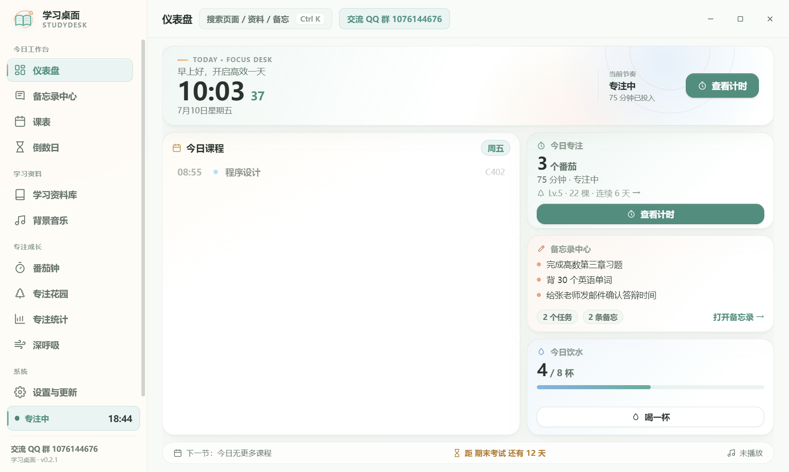

</div>

---

## 📸 界面预览

<table>
  <tr>
    <td align="center"><b>仪表盘 · 深色</b><br/>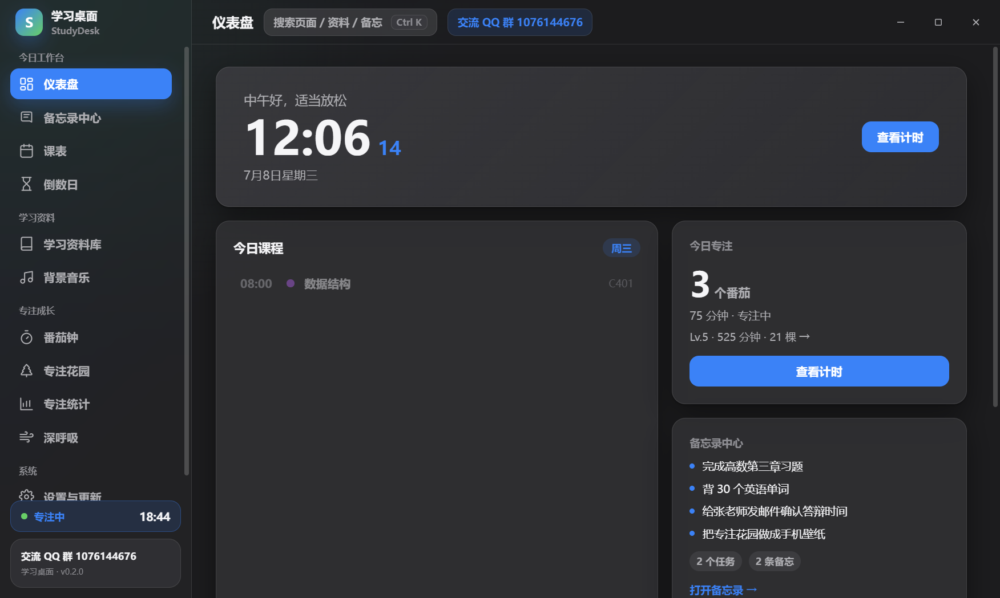</td>
    <td align="center"><b>课表</b><br/>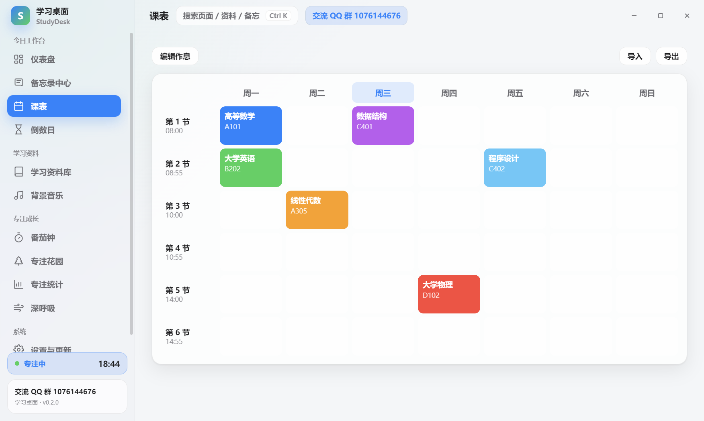</td>
  </tr>
  <tr>
    <td align="center"><b>番茄钟</b><br/>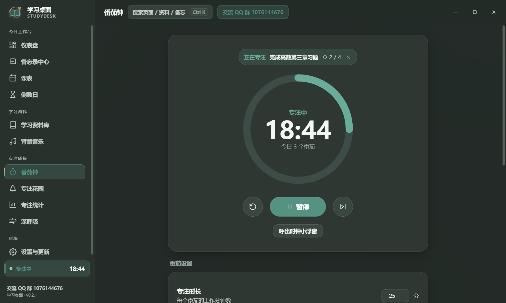</td>
    <td align="center"><b>备忘录中心</b><br/>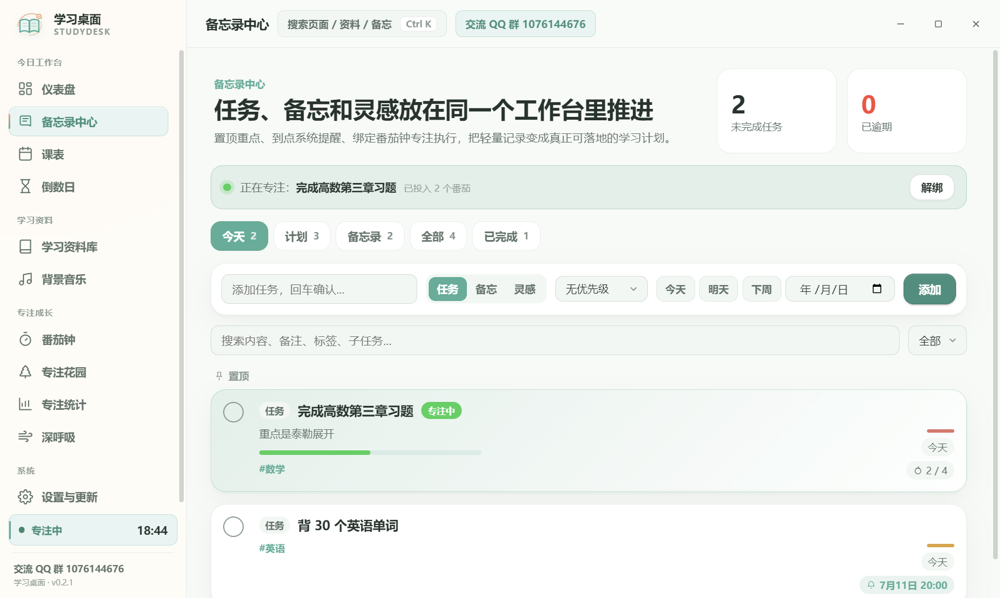</td>
  </tr>
  <tr>
    <td align="center"><b>专注花园</b><br/>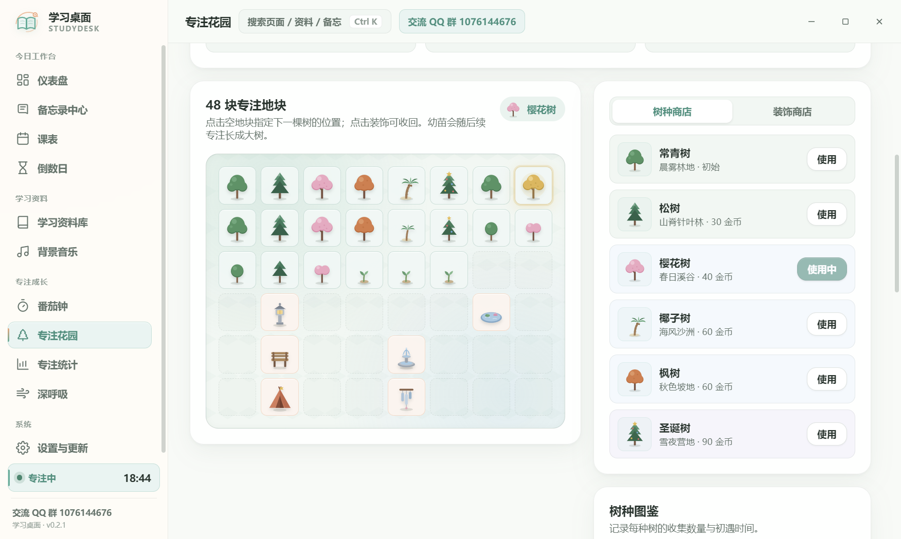</td>
    <td align="center"><b>学习资料库</b><br/></td>
  </tr>
  <tr>
    <td align="center" colspan="2"><b>联网自习室</b><br/>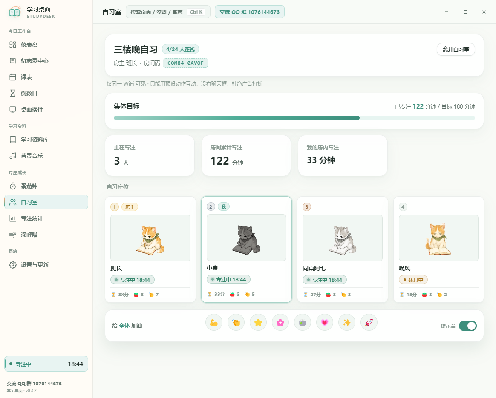</td>
  </tr>
  <tr>
    <td align="center"><b>倒数日</b><br/>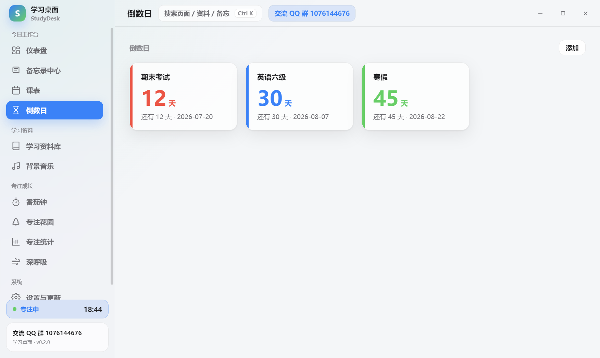</td>
    <td align="center"><b>背景音乐</b><br/>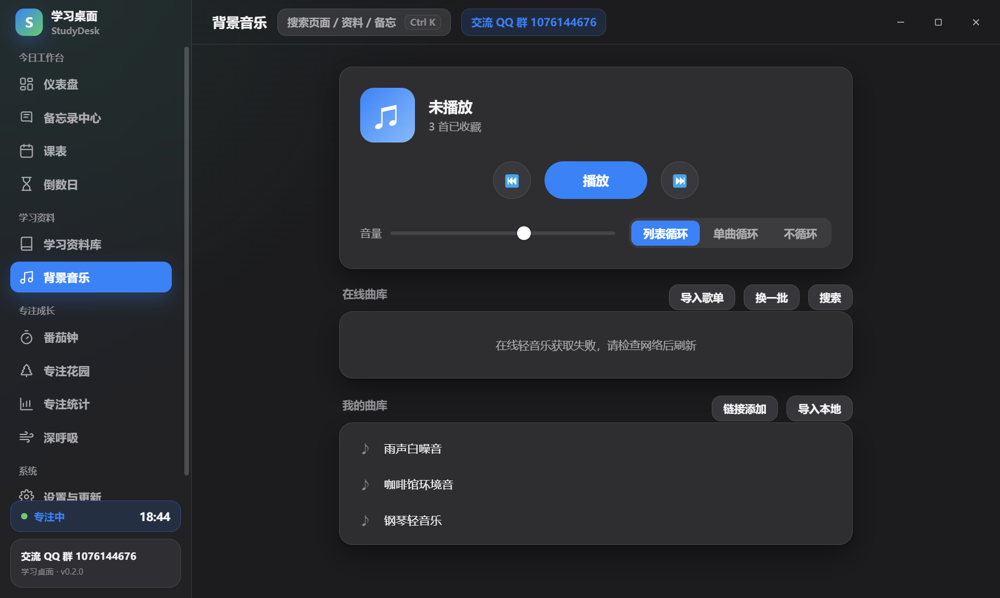</td>
  </tr>
  <tr>
    <td align="center"><b>专注统计</b><br/>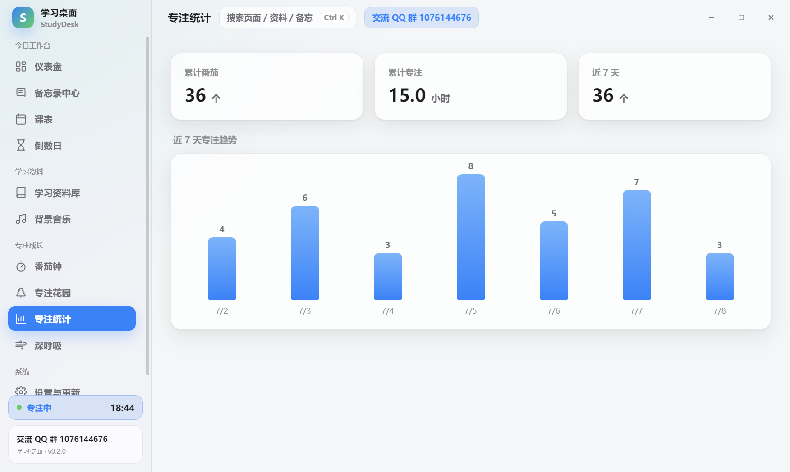</td>
    <td align="center"><b>设置</b><br/>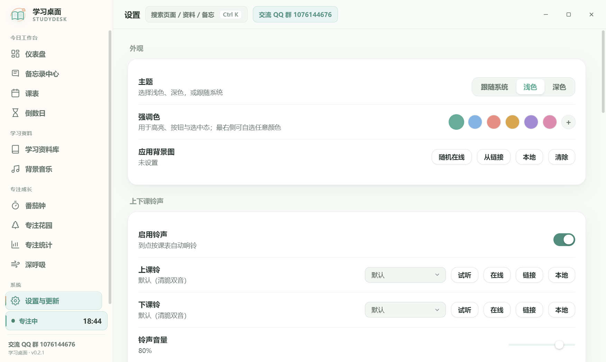</td>
  </tr>
  <tr>
    <td align="center"><b>桌面摆件管理</b><br/>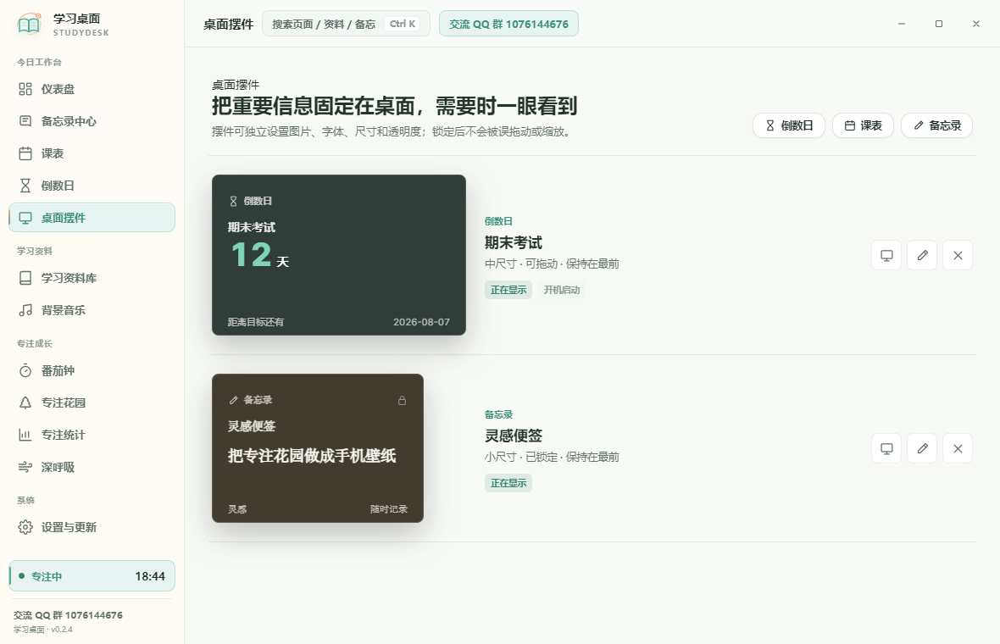</td>
    <td align="center"><b>倒数日桌面摆件</b><br/>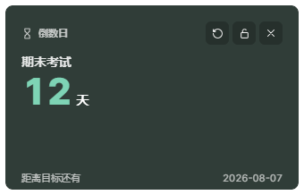</td>
  </tr>
</table>

---

## 🎯 功能特性

### 📅 课表
- 周视图网格，**当前课程高亮**、今日列高亮
- 自定义作息时间段（节次起止时间随意调整）
- 点格子增删改课程：名称 / 教师 / 地点 / 颜色 / 星期 / 节次
- 课表 **JSON 导入 / 导出**

### 🔔 上下课铃声
- 到点按课表**自动响铃**（上课 / 下课不同铃声）
- 内置**真实校园铃声**：校园电铃「铃铃铃」、威斯敏斯特音乐钟声（合成，离线可用，已设为默认上/下课铃）
- 上课同时弹**系统通知**
- 铃声支持**在线搜索**（搜「上课铃声/下课铃声」）、本地文件或在线链接，音量可调

### 🍅 番茄钟 & 专注
- **三种计时方式**：倒计时（到点自动进入休息）/ 正计时（不设终点，学多久记多久）/ 不计时（不显示数字，只记开始与结束）
- **时长随手改**：15 / 25 / 45 / 60 / 90 分钟预设，也能填任意分钟数；选过的方式与时长下次自动沿用
- 工作 / 短休 / 长休循环，时长与长休间隔可配，可自动开始下一阶段
- 圆环进度 + 大号倒计时，完成自动计入统计并提示音
- **计时以时间戳为准**：合上电脑再打开，走过的时间照算不漂移；每一段专注都会留下明细（实际时长、方式、绑定任务、是否走完）
- **锁屏壁纸专注**：专注时自动全屏置顶大字倒计时，防止分心（Esc 暂停退出）
- **4 种锁屏时钟样式**：极简 / 翻页钟 / 像素 LED / 呼吸光
- **呼出全屏时钟弹窗**：番茄钟页一键呼出全屏时钟（复用所选样式），随时进入专注视图

### 🌳 专注花园（游戏化成长）
- 每完成一个番茄 **+金币并种下一棵树**：新树以**幼苗 🌱 落地**，被后续专注**浇灌逐步长成大树**
- **每日任务**：每天 0 点刷新 3 个任务（完成番茄 / 累计分钟 / 种树），完成后手动领取金币奖励
- **装饰商店**：石灯笼 / 长椅 / 风铃 / 莲花池 / 喷泉 / 帐篷，买下后自由摆放到任意空地块、可收回重摆
- **指定种植位置**：点击空地块即可指定下一棵树落在哪里，把花园布置成自己的样子
- **金树掉落**：每次专注小概率种出**发光金树**并获得额外金币
- **树种图鉴** + **成就墙**（10 项）：收集松树 / 樱花 / 椰子 / 枫树 / 圣诞树，记录初遇时间
- 连续专注天数有金币加成，等级随累计专注时长成长

### 🧑‍🤝‍🧑 联网自习室（一起自习，但没有聊天框）
- **自习室是长期的，房间是今天的**：加入自习室是成员身份，关掉应用也还在；进出房间只是「今天来不来学」，离开房间不会退出自习室
- **开一间自己的**：起名字、写简介、定集体目标，拿到 8 位加入码发给同学；主人可随时改资料，也可以解散
- **公开大厅**：能看到此刻真的有人在学的房间，先进去学一会儿，觉得合适再点加入
- **日 / 周 / 月排行榜**：房内成员按该时间段的专注时长排名，自己的名次一直显示在顶部
- **真实的坚持天数**：连续专注天数与累计专注天数都按实际记录算，不是从注册日往下数
- **起床 / 睡觉打卡**：每天各记一次，以第一次为准，时间会显示在成员名片上
- **许愿墙**：写下一句给自己的话，同学都能看到；链接、联系方式、长串数字发不出去，看到不合适的内容可举报，攒够自动隐藏
- **看得见彼此在专注**：每位成员是自己的猫，专注时低头写字，实时显示谁在座、谁在专注
- **预设加油动作**：💪👏⭐🌸🍵💗✨🚀 八种固定动作，可对全体或某位同学发送，对方猫头顶冒气泡
- **没有聊天、没有私信、没有图片**：协议里根本不存在自由文本消息，昵称 / 房间名 / 简介 / 愿望都会自动拦截链接、微信/QQ 号、手机号与推广词，**从机制上杜绝广告**
- **不用注册**：昵称只是展示名，身份靠本机生成的匿名标识，服务端不存手机号、邮箱或任何可识别到人的信息

> 服务端是自建的（`wss://study.lemon21.cn/ws`），源码在 `server/`，数据落在服务器上的一个 SQLite 文件里。

### 🌬️ 深呼吸 / 冥想
- 课间跟随圆环做 **4-4-6 节律呼吸**（吸气 → 屏息 → 呼气），带阶段提示与组数计数，快速放松回到专注

### ✅ 备忘录中心（任务 / 备忘 / 灵感）
- 三种记录类型：**任务 / 备忘 / 灵感**，智能列表：**今天 / 计划 / 备忘录 / 全部 / 已完成**（带计数）
- **置顶**重点条目、优先级彩色旗标、截止日期（今天 / 明天 / 下周快捷芯片）、标签、子任务进度条
- **到点提醒**：设置提醒时间后**弹系统通知**（应用在托盘后台也能提醒）
- **绑定番茄钟**：任务一键「开始专注」，完成的番茄自动累计到该任务（进度 🍅 2/4 实时可见）
- **重复任务**（每天 / 每周，完成自动生成下一次）、已完成按日期分组回顾、删除有确认弹窗

### ⏳ 倒数日
- 考试 / 截止日 / 重要日子倒计时，按剩余天数排序
- 每张卡片可设**自定义背景图**（本地 / 在线 / 链接）
- 倒数日卡片可一键创建为独立桌面摆件
- 仪表盘底部显示最近一个「距 X 还有 N 天」

### 🖥️ 桌面摆件
- 支持把**倒数日 / 今日课表 / 备忘录**创建为独立桌面卡片，内容随原始数据同步更新
- 小 / 中 / 大三种尺寸：小卡突出核心信息，大卡展示更多课程或备注细节
- 每个摆件可独立设置**背景图片、底色、字体、文字色、强调色、图片遮罩与不透明度**
- 支持固定显示和开机自动启动；摆件保持桌面普通窗口层级，不会遮挡其他应用
- 卡片自带锁定开关；锁定后除小锁外完全穿透鼠标，避免误拖动，也可随时原位解锁
- 备忘录摆件集中展示全部未完成的备忘与灵感，可直接快捷记录；倒数日可在卡片上快速切换
- 内置马善政手写体、站酷小薇体、站酷庆科黄油体等艺术字体，无需联网加载
- 桌面摆件管理页统一负责显示、隐藏、编辑和移除，不删除原始课表、倒数日或备忘录数据

### 📚 学习资料库（书架升级版）
- 添加 PDF / 电子书 / Word / PPT / Excel / **JPG、PNG、WebP 等图片**，按**分类 / 状态 / 收藏 / 标签**整理
- 图片资料直接显示真实缩略图，双击仍使用系统默认程序打开
- **页码进度**：填「当前页 / 总页数」自动换算百分比，或直接拖进度条
- **阅读计时**：点「计时阅读」开始，结束自动落账到**阅读记录**，累计阅读时长一目了然
- **读书笔记**：每本书可记多条摘录 / 想法（支持页码标注），全局搜索也能搜到笔记内容
- **继续阅读**：顶部横幅直达最近在读的书
- **文件丢失检测**：源文件被移动 / 删除会标红提示，**一键重新定位**
- 双击卡片用**系统默认程序打开**，打开次数 / 最近打开自动统计

### 🎵 背景音乐
- **在线曲库**：进入即自动拉取轻音乐列表，点条目即播放、＋收藏入库（在线源为公开音乐接口）
- **一键导入网易云 / QQ 音乐歌单**：粘贴歌单分享链接自动解析曲目（基于 Meting 式聚合接口，接口地址可在设置更换为自建以提升稳定性）
- **在线搜索** + 关键词自定义，本地导入 / 链接添加
- 列表 / 单曲 / 不循环，音量记忆，跨页面持续播放
- > 提示：在线源受版权限制，部分歌曲可能只能试听或无法播放

### 📊 专注统计
- **总览**：累计专注小时、累计番茄、真实专注天数与连续天数、今天的进度
- **趋势图**：近 7 天 / 近 30 天，可按分钟或番茄个数看；日均只按真正学过的天算，不被休息日稀释
- **时段分布**：一天 24 小时的专注分布，告诉你几点最坐得住
- **时间花在哪**：按番茄钟绑定的任务累计排行
- **最近的专注**：每一段的开始时间、时长、计时方式、绑定任务与是否走完

### 💧 喝水 & 🧍 健康提醒
- 喝水提醒（可配间隔 + 每日目标），仪表盘「喝一杯」计数与进度
- 久坐提醒、护眼 20-20-20

### 🪟 系统集成 & 个性化
- macOS 风外壳 + 右上角窗口控制；**桌面浮窗**（置顶可拖：时钟 + 下节课 + 番茄迷你计时）+ **全屏时钟弹窗**
- **关闭即最小化到托盘后台常驻**（启动即建托盘，点右上角关闭不退出，托盘右键「退出」才真正退出）
- 系统托盘常驻、开机自启、全局热键；侧边栏实时显示**番茄迷你计时**，随点随回
- **全局搜索 Ctrl+K**（页面 / 课程 / 备忘 / 资料 / 倒数日）
- 明暗主题 + 6 种预设强调色 + **任意自定义强调色**（取色器随便挑）+ **自定义应用背景图**（界面透明度 0–100% 可调）
- **全局轻提示 / 确认弹窗**：操作有即时反馈，删除等危险操作有二次确认
- **数据备份 / 恢复**（一键导出 / 导入全部 JSON）
- **自动更新**（基于 GitHub Release：**检测到新版本应用内弹窗提醒** + 下载进度条 + 下载完成弹窗与系统通知 + 一键重启安装）

---

## 🧱 技术栈

| 层 | 技术 |
| --- | --- |
| 桌面外壳 | Electron 33 |
| 构建 | electron-vite 2 + Vite 5 |
| 前端 | Vue 3.5（`<script setup>` + TypeScript） |
| 状态 / 路由 | Pinia 2 / Vue Router 4 |
| 持久化 | 自实现 JSON Store（系统 `userData` 目录） |
| 打包 / 更新 | electron-builder 25 + electron-updater |
| 测试 | Vitest（单元）+ 运行时冒烟脚本 |

---

## 🚀 快速开始

```bash
# 安装依赖（已内置 npmmirror 镜像，国内无需额外配置）
npm install

# 开发运行（热更新）
npm run dev

# 类型检查 / 单元测试
npm run typecheck
npm test

# 构建与打包
npm run build          # 仅构建到 out/
npm run build:dir      # 生成免安装目录 release/win-unpacked/
npm run build:win      # 生成 NSIS 安装包
```

> 环境要求：Node.js ≥ 18、Windows 10/11。

---

## 📦 下载与自动更新

- 前往 [**Releases**](https://github.com/miku1130/study-desk/releases) 下载最新 Windows 安装包。
- 应用内 **设置 → 关于与更新 → 检查更新**：安装版会从 GitHub Release 比对版本，自动后台下载新版并提示「立即重启更新」。
- 推送 `v*` 标签会触发 [GitHub Actions](.github/workflows/release.yml) 自动构建并发布 Release。

---

## 🗂️ 项目结构

```
src/
├── main/            主进程：窗口/托盘/IPC/持久化/番茄引擎/铃声/锁屏/备忘提醒/在线搜索/歌单解析/喝水/健康/更新
│   └── studyRoom/   自习室：protocol 协议与文本清洗 / onlineClient 服务器长连接 / service 状态编排
├── preload/         contextBridge 安全 API（window/media/online/playlist/studyRoom/update/fs/todos…）
└── renderer/        Vue 应用
    └── src/
        ├── views/         各功能页面（专注花园 GardenView / 备忘录 TodoView / 资料库 BookshelfView…）
        ├── components/     通用组件（侧边栏/窗口控制/弹窗/在线搜索/全局反馈 UiFeedbackHost…）
        ├── stores/         Pinia 状态（garden 花园 / books 资料库 / todos 备忘录 / ui 全局反馈…）
        ├── composables/    组合式逻辑（时钟/课表状态/全局副作用）
        └── styles/         macOS 设计变量与主题
server/             自习室服务端：SQLite 持久层 / 在座状态 / WebSocket 路由（部署在自建服务器）
docs/screenshots/   README 截图
scripts/            截图 / 图标 / 冒烟测试脚本
```

---

## 🧪 测试与质量

- `npm run typecheck`：`tsc` + `vue-tsc` 全量类型检查（0 错误）
- `npm test`：Vitest 单元测试 264 项（番茄引擎 / 铃声调度 / 时间工具 / 窗口生命周期与位置恢复 / 自习室协议与文本清洗 / 服务端持久层与在座状态 / 端到端互联）
- `npm run smoke`：启动 Electron 逐路由校验渲染与控制台错误（21 路由全 PASS）
- `node server/scripts/smoke.mjs`：对服务端起真实连接跑完整链路（建室 / 进出房 / 打卡 / 许愿 / 解散，29 项）

---

## 🆕 版本历史

### v0.6.1（最新）
- **修复锁屏专注可能叠出第二个全屏窗、而且再也关不掉**：`close()` 是异步的，关闭的瞬间窗口还活着，此时若又要开锁屏就会同时存在两个；更糟的是旧窗口随后触发 `closed`，会把已经指向新窗口的引用清成 null，新窗口从此谁也关不掉。现在改为同步销毁并按窗口身份校验回调
- **全局快捷键注册失败不再沉默**：被别的程序占用或组合键写法不合法时，设置页会在对应输入框下方直接说明原因，不用再靠「按了没反应」去猜
- **记住主窗口的大小和位置**：下次打开还在原地；外接屏拔掉后会自动收回主屏中央，不会开在看不见的地方
- **猫咪桌面挂件隐藏后不再空转**：挂件是隐藏而不是销毁（避免每次重开闪一下），以前关掉后动画和计时仍在满速跑，现在隐藏即让出 CPU

### v0.6.0
- **自习室改成联网的，并且分清了两个概念**：加入 / 退出「自习室」是长期的成员身份，进入 / 离开「房间」只是今天来不来学。离开房间不会退出自习室，明天还能回来
- **自习室有主人**：起名字、写简介、定集体目标、发 8 位加入码，主人可随时改资料或解散；成员可以自己退出
- **公开大厅**：能看到此刻真的有人在学的房间，先进去学一会儿，想留下再点加入
- **日 / 周 / 月排行榜**：房内成员按该时段的专注时长排名，自己的名次一直挂在顶部
- **真实的坚持天数**：连续专注天数与累计专注天数都按实际记录算，不是从注册日往下数
- **起床 / 睡觉打卡**与**个人简介**，都会显示在成员名片上
- **许愿墙**：链接、联系方式、长串数字发不出去；看到不合适的内容可举报，攒够自动隐藏，主人和作者都能删
- **番茄钟支持三种计时方式**：倒计时 / 正计时 / 不计时，时长有 15–90 分钟预设也能填任意值，选过的下次自动沿用
- **计时不再漂移**：改用时间戳记账，合上电脑再打开走过的时间照算；每一段专注都留明细（实际时长、方式、绑定任务、是否走完）
- **统计页基于明细重做**：累计 / 今日 / 真实专注天数与连续天数、7 与 30 天趋势（分钟或番茄）、24 小时时段分布、任务耗时排行、最近专注列表
- **修复猫咪待机动画抖动**：改为单帧立绘 + 极轻的 CSS 摆动，开启「减弱动态效果」时自动静止
- 局域网自习室下线，由联网自习室完整取代
- 新增服务端（`server/`，SQLite 持久化 + WebSocket），测试增至 250 项，服务端另有 29 项端到端冒烟

### v0.4.2
- **修复鼠标碰到桌面摆件（尤其课表）就整张卡片消失的问题**：Windows 上取消鼠标穿透会连带清掉 `WS_EX_LAYERED`，而 Win11 桌面层正是靠这个扩展样式显示摆件；样式丢失后摆件仍是桌面层子窗口，健康检查判定「已挂载」因而不会自愈，卡片会一直不见
- **修复「解锁摆件」系统提示条卡在最顶层不消失**：指针从小锁上直接移出窗口时收不到后续 mousemove，摆件会一直抓着鼠标；现补上移出窗口与窗口失焦的兜底，并在锁定状态变化时一并复位
- 解锁摆件时不再因为同一处样式问题而闪没

### v0.4.1
- **自习室显示每个人的两个专注时长**：座位卡片上「今日自习室」为主、「今日总专注」为辅；今日自习室时长由每位成员本机按天累计，**换房间、退出重进、断线重连都会接着记**，跨天自动归零
- 概览卡「我的房内专注」改为「**我今天在自习室**」，与座位卡片口径一致；集体目标与排行仍用房主权威计时，不受自报数据影响
- **修复猫咪写字动画一卡一卡的问题**：原素材是 22 张彼此独立的画（角度、比例、姿势都不一致），逐帧播放必然抖动；改为单张立绘 + 呼吸与笔触两层 CSS 位移，任何刷新率下都平滑，也不再有循环接缝
- 自习室座位改用轻量渲染，满员 24 人也不会同时解码 24 路视频；待机动作仍保留逐帧手绘循环动画
- 移除不再使用的写字动画视频，安装包减小约 290 KB

### v0.4.0
- **全新局域网自习室**：同一 WiFi 下创建 / 搜索 / 加入自习室，每位成员显示为自己的猫，专注时低头写字，实时同步阶段、剩余时间与今日专注
- **集体目标与房内排行**：房主设定目标分钟数，全员专注时长累加，达成后全员提醒；按房内专注时长排名
- **预设加油动作**：8 种固定动作可对全体或指定同学发送，猫头顶冒气泡并有轻提示音
- **从机制上杜绝广告**：通信协议里不存在任何文本消息，只传白名单动作 id；昵称与房间名自动拦截链接、微信 / QQ 号、手机号与推广词，且一律由房主重新清洗后才进入名册
- **零服务器、零账号**：UDP 发现 + TCP 直连，仅用 Node 内置能力，不新增依赖、数据不出局域网；广播被隔离时可用 10 位房间码加入
- 新增 64 条测试（协议清洗 / 房间码 / NDJSON 编解码 / UDP 发现 + 两个真实服务的端到端互联），冒烟验收扩展到 21 个路由

### v0.3.5
- **猫咪伴学**：新增猫咪房间与 3 款猫咪 / 3 间房 / 家具衣柜与纪念品收藏，番茄专注与上课时自动陪伴并赠送小礼物
- **猫咪桌面挂件**：专注或上课时可在桌面显示写字猫动画，锁屏专注页同步呈现
- **备忘录附件**：支持图片直接展示与文件一键打开，桌面备忘录摆件同步适配

### v0.3.4
- 修复接入 Windows 桌面层后未锁定摆件无法拖动的问题，改用经过主进程校验的指针拖动通道
- 可交互摆件位于桌面图标层上方，锁定后恢复鼠标穿透；实机验证拖动位移和锁定拦截均符合预期

### v0.3.3
- 桌面摆件接入 Windows Explorer 的 `WorkerW / Progman` 桌面层，点击「显示桌面」或按 `Win+D` 后不再消失
- 兼容新版 Windows raised-desktop 模式：摆件位于桌面图标层与壁纸层之间，普通应用仍会正常覆盖摆件
- 增加 Explorer 桌面层状态检查与自动重挂载，保留透明圆角、锁定穿透、拖动缩放和多显示器坐标

### v0.3.2
- 仪表盘课程卡片和桌面课表摆件会实时隐藏已经下课的课程，让当前课程及后续晚课优先显示
- 课程在结束时间到达前持续保留，结束后立即移除；完整课程表页面仍展示全天安排

### v0.3.1
- 摆件增加常驻小锁，锁定后主体鼠标穿透，仅锁按钮保留交互；窗口改为桌面普通层级，不再覆盖其他应用
- 修复编辑弹窗无法打开、图片背景不受卡片不透明度控制，以及透明窗口四周出现方形黑底的问题
- 所有外观与行为属性支持实时预览并同步到真实桌面摆件，取消编辑可恢复原配置
- 备忘录摆件展示全部未完成备忘和灵感并支持快捷记录，倒数日增加卡片内快速切换
- 随安装包内置 3 款中文艺术字体及 OFL 许可证；Electron 冒烟验收扩展到 17 个路由和关键交互

### v0.3.0
- **全新桌面摆件系统**：倒数日、今日课表、备忘录均可创建独立桌面卡片，并与原始数据同步
- 摆件支持小 / 中 / 大尺寸、固定显示、置顶、开机启动、位置与大小锁定，以及背景图、底色、字体、文字色、强调色、遮罩和不透明度自定义
- 倒数日沿用手机组件式信息层级，核心天数优先；课表和备忘录会根据卡片尺寸逐层增加信息
- 学习资料库新增 JPG / PNG / WebP / GIF / BMP 图片导入与真实缩略图预览
- Electron 冒烟验收扩展到 16 个路由，并增加 100% 不透明度计算样式断言

### v0.2.4
- 界面透明度调至 100% 时，侧边栏与内容底板现在真正完全透明，不再残留颜色、模糊和侧边阴影，背景壁纸可以完整显示
- 卡片、输入框和按钮仍保留轻量玻璃底色，兼顾壁纸展示与文字可读性
- 修复开发模式误将 `electron.exe` 注册为开机启动项、导致开机额外显示 Electron 默认页面的问题

### v0.2.3
- 修复应用背景透明度滑块只影响底图、前景界面仍然接近实色的问题
- 透明度现在同步作用于侧边栏、内容区、卡片、输入框和次级按钮；100% 时呈现轻量玻璃层
- 将设置项明确调整为「界面透明度」，支持从 0% 实色到 100% 高透明平滑变化

### v0.2.2
- **全新视觉系统**：升级品牌标识、图标、色彩层级、卡片与空状态，重做仪表盘、专注花园、学习资料库等核心页面
- **课表真实时间轴**：每个纵向格固定代表 1 小时，课程卡片按实际起止时间与持续分钟数等比例定位和缩放
- **课程信息更完整**：卡片显示课程名称、起止时间、上课时长，并在空间足够时显示教师与地点
- 更新应用图标、功能截图、视觉规范测试与课程表布局单元测试

### v0.2.1
- **检测到新版本应用内弹窗提醒**：发现更新即弹窗显示版本号与实时下载进度；下载完成再次弹窗，可「立即重启更新」或「稍后再说」（每阶段关闭后本次会话不重复打扰）

### v0.2.0
三大模块深度重做 + 全面精致化：

- **备忘录中心全面升级**：任务 / 备忘 / 灵感三类记录、置顶、标签、子任务、**到点系统通知提醒**、**任务绑定番茄钟自动累计**、已完成按日分组、今天 / 明天 / 下周快捷日期
- **学习资料库全面升级**：页码进度、**阅读计时与阅读记录**、**读书笔记（带页码摘录）**、收藏、继续阅读横幅、**文件丢失检测与一键重定位**
- **专注花园游戏化重做**：幼苗 → 大树**真实成长机制**、**每日任务系统**（3 任务 / 天，领金币）、**装饰商店与自由摆放**（灯笼 / 长椅 / 喷泉…）、**指定种植位置**、**金树稀有掉落**、树种图鉴、成就扩充到 10 项
- **交互与个性化**：全局轻提示 Toast、危险操作确认弹窗、**任意自定义强调色**、侧边栏番茄迷你计时、列表增删动画、键盘焦点高亮
- 番茄钟页显示当前绑定任务；仪表盘置顶任务优先展示

### v0.1.5
- **一键导入网易云 / QQ 音乐歌单**（Meting 式聚合接口，可自建替换）、在线曲库自动拉取
- 番茄钟页**全屏时钟弹窗**；自动更新体验修复（下载进度条 + 一键重启安装）

### v0.1.4
- 启动即创建系统托盘，修复「关闭到托盘后无法恢复窗口」

### v0.1.3
- **4 种锁屏时钟样式**（极简 / 翻页钟 / 像素 LED / 呼吸光）
- **课间深呼吸**（4-4-6 节律）；**专注森林游戏化**（金币 / 树种商店 / 成就）

### v0.1.2
- **内置真实校园铃声**（电铃 / 威斯敏斯特钟声）；背景不透明度支持 100%
- **关闭最小化到托盘常驻**；在线音乐 / 铃声搜索

### v0.1.1 / v0.1.0
- 初始版本：课表 / 上下课铃声 / 番茄钟 / 锁屏专注 / 背景音乐 / 待办 / 书架 / 倒数日 / 喝水与健康提醒 / 专注统计 / 数据备份恢复 / 全局搜索 / 明暗主题 / GitHub Release 自动更新

---

## 🛣️ 路线图

- [x] 课表 / 铃声（真实校园铃声）/ 番茄钟 / 锁屏专注（4 种时钟样式 + 全屏时钟弹窗）/ 背景音乐
- [x] 备忘录中心（任务 / 备忘 / 灵感 + 置顶 + 到点提醒 + 番茄绑定）/ 倒数日 / 专注统计
- [x] 学习资料库（页码进度 / 阅读计时 / 读书笔记 / 收藏 / 丢失重定位）
- [x] 专注花园（成长机制 / 每日任务 / 装饰摆放 / 图鉴 / 金树）/ 深呼吸冥想
- [x] 在线音乐搜索 / 一键导入网易云·QQ 歌单 / 音乐接口可配置
- [x] 喝水 & 健康提醒 / 桌面浮窗（关闭最小化到托盘）/ 全局搜索
- [x] 倒数日 / 今日课表 / 备忘录桌面摆件（锁定 / 开机启动 / 自定义外观）
- [x] 猫咪伴学（猫咪房间 / 桌面挂件 / 纪念品收藏）
- [x] 联网自习室（成员身份与今日在座分离 / 日周月排行 / 打卡 / 许愿墙 / 预设加油 / 无聊天防广告）
- [x] 番茄钟三种计时方式 + 专注明细 / 统计页时段分布与任务耗时排行
- [x] 明暗主题 / 任意自定义强调色 / 自定义背景 / 数据备份恢复 / 自动更新
- [ ] 统计热力图、番茄白噪音场景、自习室长期战绩

---

## 🤝 资源约定

壁纸、铃声、音乐等媒体可在对应页面「本地 / 从链接 / 在线搜索 / 导入歌单」获取；在线资源会下载到本地后离线使用。内置默认：合成校园铃声（电铃 / 音乐钟声）、提示音兜底、渐变锁屏背景。

> **音乐 / 歌单接口**：在线搜索基于 iTunes 公共接口（合法、免 key，为 30s 试听片段）；网易云 / QQ 歌单导入基于 [Meting](https://github.com/metowolf/meting) 式聚合接口，默认使用公共实例（可能不稳定），可在「设置 → 音乐接口」填入自建 [Meting-API](https://github.com/metowolf/Meting-API) / [NeteaseCloudMusicApi Enhanced](https://github.com/NeteaseCloudMusicApiEnhanced/api-enhanced) 地址以提升稳定性与解锁能力。部分歌曲受版权限制可能仅试听或无法播放。

---

## 💬 交流与反馈

- **交流 QQ 群：`1076144676`** —— 欢迎加群交流使用问题、反馈 Bug、提出新功能建议。
- 应用内 **设置 → 关于与更新** 也可查看并一键复制群号。
- 亦可通过 [GitHub Issues](https://github.com/miku1130/study-desk/issues) 提交问题。

---

## 📄 许可证

[MIT](LICENSE) © StudyDesk
